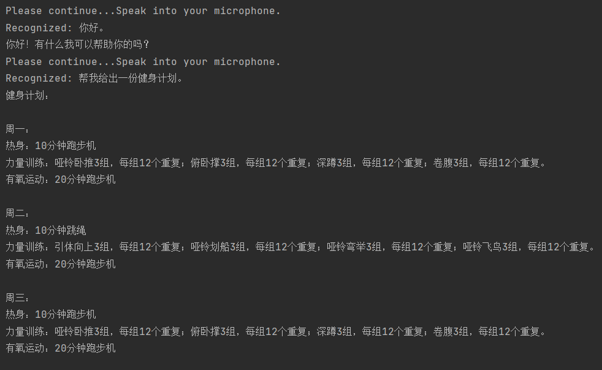

# interaction_use_LLM

### 项目介绍

利用LLM技术，让人和机器人进行交互。

使用设备：Azure Kinect DK

目前实现：利用麦克风功能，实时对话，并给出回复。

待实现：加入摄像头、机器臂，实现更多的交互。


### 如何运行

1. 安装依赖

```bash
pip install -r requirements.txt
```

2. 环境变量
SPEECH_KEY和SPEECH_REGION需要去申请azure账号

```bash
setx OPENAI_API_KEY sk-xxx
setx SPEECH_KEY sk-xxx
setx SPEECH_REGION sk-xxx
```

3. 运行

```bash
python speech_chat.py
```

#### 运行效果截图


